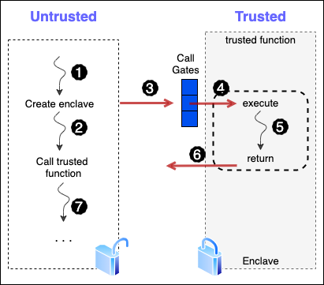
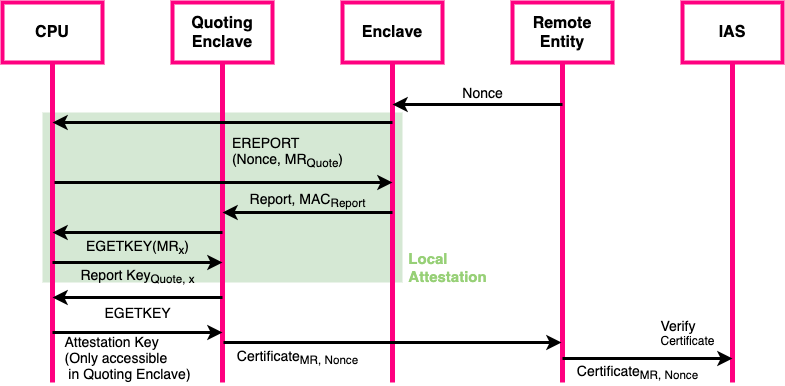

# Intel SGX

IThe recent advent of hardware-based trusted execution environments (TEE) provides the isolated execution even from an untrusted OS and hardware-based attacks. Typically, Attackers target vulnerabilities in existing virtualized system software, or they compromise the credentials of privileged system administrators\cite{scone}. Intel Software Guard Extension (SGX) is Intel's product which provides security and protection by creating an **enclave** in applications's virtual address space. An enclave shields application code and data from accesses by other software, including higher-privileged software. Once an enclave has been initialized, code and data within the enclave is isolated from the rest of the system. Generally, there are three important features which collectively guarantee the security of a system:
* Confidentiality: A feature which guarantees receiver that the received data was not recognizable by any third entity. This can be implemented by encrypting the data.
* Integrity:A feature which guarantees the receiver that the received data is remained intact. This can be implemented by putting data hash near the data.
* Freshness: A feature which guarantees the receiver that the received data is the latest and the newest one.

Freshness guarantees are typically built on top of a system that already offers integrity guarantee, by adding a unique piece of information to each message. According to below figure, an enclave is created in virtual address space of a process, and it contains specific codes and data needed to be isolated.

To understand how SGX works, At boot time, the BIOS verifies whether SGX is enabled. It then reserves a region of physical memory for the CPU, designated as the Processor Related Memory (PRM). This memory area is encrypted using the Memory Encryption Engine (MEE), a new and dedicated chip which sits between the CPU and the Memory Controller. So, the OS, hypervisor or any external device, or any other applications running over the processor would not be able to access the PRM. As a result, there is a region of a memory which resembles a hole inside the memory which is completely in the control of the CPU. Internally PRM is divided into several parts including EPCs and EPCM. EPCs are used to actually store the enclaves of the various applications present in the program. Note that, each EPC is divided into 4Kb pages. On the other hand, EPCM stores some management related information. EPCM is divided into various sub-regions and we have one entry for each EPC. For example, if there are 1024 EPC regions each of 4KB, then there would be 1024 regions in the EPCM, one region is associated with a corresponding EPC. It stores various information related to the corresponding EPC such as EPC’s page mappings, so EPCM is somewhat similar to the page tables, but the difference is that the most of the page tables are managed by the OS while with the SGX the EPCM contents are completely managed by the CPU. As illustrated in below figure , there are multiple processes present in the system and each process has its own virtual address space and within this virtual address space each process could have its own enclave. Therefore we would now have a mapping for enclave region within the virtual address space to PRM region in the memory. So, we could have multiple processes, and each of them having their own enclaves but all of enclaves associated with their own processes would mapped to the same region within the memory that is the PRM region.
Enclaves are isolated from the operating system as well as each other . So, any attempt to read or write EPC memory by non-enclave threads returns an abort page value.

When an EPC cache line is evicted from the cache to memory, the MEE encrypts and generates a MAC of the cache line and stores the encryption key and MAC. When the cache line is retrieved during a cache miss, the MEE decrypts the cache line and verifies its integrity using the stored MAC before transferring the cache line back to the CPU. Enclaves are created by untrusted code using the **ECREATE** instruction, which initializes an SGX enclave control structure (SECS) in the EPC. it contains global information and metadata about that particular enclave. It is used for data integrity inside enclaves and also for mapping information to the various enclave regions. The **EADD** instruction adds pages to the enclave. SGX records the enclave to which the page was added, its virtual address and its permissions, and it subsequently enforces security restrictions, such as ensuring the enclave maps the page at the accessed virtual address. When all enclave pages are loaded, the **EINIT** instruction creates a cryptographic measurement, which can be used by remote parties for attestation. After enclave initialization, an unprivileged application can execute enclave code through the **EENTER** instruction, which switches the CPU to enclave mode and jumps to a predefined enclave offset. Conversely, the **EEXIT** instruction causes a thread to leave the enclave. In addition, The **EWB** instruction is used to evict an EPC page to a non-EPC page. When executing an **EWB** instruction, the processor securely encrypts and MACs the page before flushing it to the main memory buffer. The **ELDU** and **ELDB** instructions are used to load a non-EPC page back into the EPC memory. When executing an **ELDU** or **ELDB** instruction, the processor essentially performs the reverse of the **EWB** instruction. The processor verifies the page’s integrity with the MAC, decrypts the page, and updates the EPCM with the new mapping. Replay attacks are avoided by removing the VA page entry corresponding to the page.

|**Instruction**|**Description**|
|:-------------:|:-------------:|
|ECREATE|Declare base and range, start build|
|EADD | Add 4k page |
|EEXTEND | Measure 256 bytes|
|EINT | Declare enclave built|
|EENTER | Enter enclave|
|EEXIT | Leave enclave|
|AEX | Asynchronous enclave exit|

SGX supports multi-threaded execution inside enclaves, with each thread’s enclave execution state stored in a 4 KB thread control structure (TCS). An application which needs secure environment in SGX-enabled CPUs, should be divided into two parts: A secure part which is launched inside enclave and non-secure part which resides out of the enclave. Enclave code and data are placed and encrypted in EPC. And pages are only decrypted when they are inside the physical processor core. Keys are generated at boot-time and are stored within the CPU. So, when data or code from the enclave is going in or out of the processor, no attacker could actually identify the actual data or code by monitoring or snooping the memory bus.

The security model of Intel SGX states that only the CPU needs to be trusted and all software including applications and the OS is considered untrusted. Therefore, applications gain the ability to defend itw own secrets, thereby reducing the attack surface. SGX-enabled processors offer crucial properties:
* Isolation which means each enclave's environment is isolated from the untrusted software outside of the enclave.
* Attestation: This property allows a party to authenticate the software running inside an enclave. This party can be either local or remote.  
* Sealing: cryptographically protecting data when it leaves the enclave. Secret sealing lets SGX enclaves securely store protected data outside the enclave, to reload when necessary.

Intel SGX is the newest technology to solve Secure Remote Computation problem called (Remote Attestation) by leveraging trusted hardware in the remote computer. With remote attestation, a combination of Intel SGX software and platform hardware is used to generate a quote that is sent to a third-party server to establish trust. The software includes the application’s enclave, and the Quoting Enclave (QE) and Provisioning Enclave (PvE), both of which are provided by Intel. The attestation hardware is the Intel SGX-enabled CPU. A digest of the software information is combined with a platform-unique asymmetric key from the hardware to generate the quote, which is sent to a remote server over an authenticated channel. If the remote server determines that the enclave was properly instantiated and is running on a genuine Intel SGX-capable processor, it can now trust the enclave and choose to provision secrets to it over the authenticated channel. Note that, ach enclave uses the processor’s intrinsic root secret (EPID) to generate a set of unique keys. There are three important keys for protection in SGX:

|**Key**|**Purpose**|
|:-----:|:---------:|
|Report Key|Local Attestation|
|Attestation Key|Remote Attestation|
|Seal Key|Sealing Enclave Secret|

During attestation, only report and attestation keys are used. The basic attestation process works as follows:

1. A remote user sends a nonce to the enclave E. Note that the user does not trust the enclave yet.
2. The enclave E must now prove to a special Intel-provided quoting enclave Q that it is a real enclave. This process is also called local attestation.
 * Enclave E asks the processor generate a report to certify E’s authenticity as a legitimate enclave.
 * Enclave E then sends the report to the quoting enclave Q, which verifies the report.
 3. At this point, the quoting enclave Q now trusts enclave E. The quoting enclave Q now retrieves the attestation key from the CPU and uses it to generate a certificate proving the legitimacy of enclave E. The certificate is sent to the remote user.
 4. The remote user can verify the attestation by checking certificate using the Intel Attestation Service (IAS).

the abovementioned steps are illustrated in Figure.

While SGX provides data confidentiality and integrity by a feature called sealing, it does not provides data freshness. In addition, The architecture of SGX suffers from two major limitations: First, EPC is a limited resource, as the current iteration of SGX, the maximum EPC size is limited to 128 MB, of which only 93MB are usable by applications; the rest is allocated for metadata and cannot be used by enclaves. To overcome this limitation, SGX supports a secure paging mechanism to an unprotected memory region. However, the paging mechanism incurs very high overheads depending on the memory access pattern. Second, the execution of system calls is prohibited inside the enclave. To execute a system call, the executing thread has to exit the enclave. Such enclave transitions are expensive especially, for middleboxes because of security checks and TLB flushes. Also, an enclave context switch (or exiting the enclave synchronously for issuing system calls) is quite expensive in the SGX architecture. The SCONE\cite{scone} framework overcomes this limitation using an asynchronous system call mechanism. However, SGX does not provide any security guarantees for stateful computations, i.e., across system reboot or crash. Further, the trust from the TEE does not naturally extend to the untrusted persistent storage medium.

## Sealing to the Enclave Identity

When sealing to the Enclave Identity, the key is unique to the particular enclave that sealed the data and any change to the enclave that impacts its signature will result in a new key. With this method, data sealed by one version of an enclave is inaccessible by other versions of the enclave, so a side effect of this approach is that sealed data cannot be migrated to newer versions of the application and its enclave. This is intended for applications where old, sealed data should not be used by newer versions of the application.

## Sealing to the Sealing Identity

When sealing to the sealing identity, multiple enclaves from the same authority can transparently seal and unseal each other’s data. This allows data from one version of an enclave to be migrated to another, or to be shared among applications from the same software vendor.
If older versions of the software and enclave need to be prevented from accessing data that is sealed by newer application versions, the authority can choose to include a Software Version Number (SVN) when signing the enclave. Enclave versions older than the specified SVN will not be able to derive the sealing key and thus will be prevented from unsealing the data.

## Local Attestation

Local attestation is useful when applications have more than one enclave that need to work together to accomplish a task or when two separate applications must communicate data between enclaves. Each enclave must verify the other in order to confirm that they are both trustworthy. Once that is done, they establish a protected session and use an ECDH Key Exchange to share a session key. That session key can be used to encrypt the data that must be shared between the two enclaves. Because one enclave cannot access another enclave’s protected memory space, even when running under the same application, all pointers must be dereferenced to their values and copied, and the complete data set must be marshaled from one enclave to the other.

## Remote Attestation

With remote attestation, a combination of Intel SGX software and platform hardware is used to generate a quote that is sent to a third-party server to establish trust. The software includes the application’s enclave, and the Quoting Enclave (QE) and Provisioning Enclave (PvE), both of which are provided by Intel. The attestation hardware is the Intel SGX-enabled CPU. A digest of the software information is combined with a platform-unique asymmetric key from the hardware to generate the quote, which is sent to a remote server over an authenticated channel. If the remote server determines that the enclave was properly instantiated and is running on a genuine Intel SGX-capable processor, it can now trust the enclave and choose to provision secrets to it over the authenticated channel. Each enclave uses the processor’s intrinsic root secret (EPID) to generate a set of unique keys.
