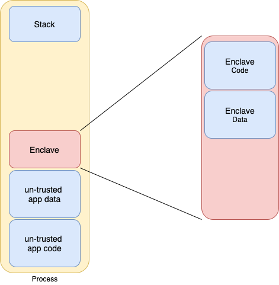
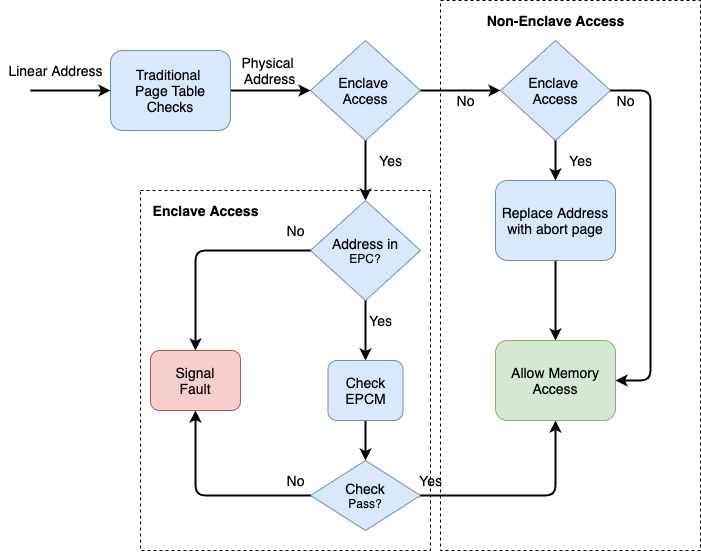
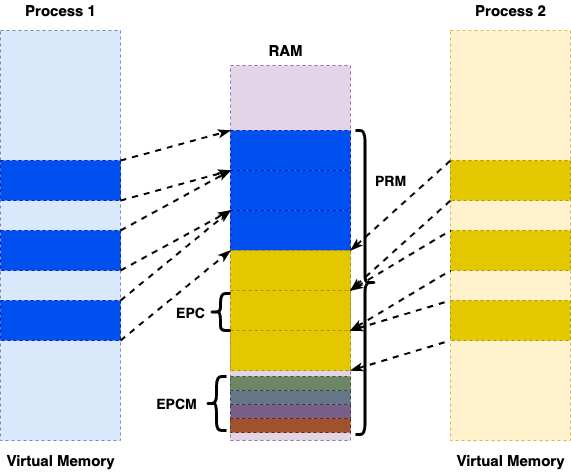

# Intel SGX

Intel Software Guard Extension (SGX) is a set of extensions on 6th, 7th, 8th and 9th generations of
the Intel Core processor, Intel Xeon processor E3-1500 versions 5 and 6 and E-2100 family.
SGX extension provides hardware-based isolation and memory encryption to provide more code protection
for developers. It aims also to provide confidentiality and integrity guarantee to security-sensitive
data and computation where all privileged softwares such as kernel and hypervisors are potentially malicious. In other words, the security model of Intel SGX states that only the CPU needs to be trusted and all software including applications and the operating system is considered untrusted. Secured containers which is called  enclaves are protected by hardware mechanisms and no malicious application, operating system or virtual machine monitor can access the information in enclaves. Furthermore, the memory belonging to these enclaves is transparently encrypted by the CPU to defend against physical hardware attacks and they can attest their current state to a remote party to prove that they have not been modified during loading. SGX-enabled processors offer two crucial properties:
* Isolation which means each enclave's environment is isolated from the untrusted software outside of the enclave,
* Attestation: This property allows a remote party to authenticate the software running inside an enclave.

An application using Intel SGX extension is built in trusted and un-trusted parts. The application creates an enclave inside its own address space and puts trusted part into that enclave. When the application calls trusted part, it will run in a completely protected mode and external access to enclave data is completely denied.

Enclave code and data are placed in a special memory area called the Enclave Page Cache (EPC). This memory area is encrypted using the Memory Encryption Engine (MEE), a new and dedicated chip. The Enclave Page Cache Map (EPCM) structure is used to store the pages state. It is located inside the protected memory and its size limits the size of the EPC.

Another thing which Intel processor has achieved is that it ensures that when data or code from the enclave is going in or out of the processor, no attacker could actually identify the actual data or code by monitoring or snooping the DRAM bus, because the enclave data or code is encrypted. So, essentially any data which is to be executed from the enclave is going to be stored in the RAM in an encrypted state. Now when this data is moved from the RAM to the processor it gets decrypted within the processor.

Intel SGX is the newest technology to solve Secure Remote Computation problem by leveraging trusted hardware
in the remote computer. Secure Remote Computation is the problem of executing software on a remote computer
owned and maintained by an untrusted party. The trusted hardware establishes a secure container, and the remote computation service user uploads the desired computation and data into the secure container. The trusted hardware protects the data’s confidentiality and integrity while the computation is being performed on it. For example, a cloud service that performs image processing on confidential medical images could be implemented by having users upload encrypted images. The users would send the encryption keys to software running inside an enclave. The enclave would contain the code for decrypting images, the image processing algorithm, and the code for encrypting the results. The code that receives the uploaded encrypted images and stores them would be left outside the enclave. While SGX provides confidentiality and integrity of the data and computation inside an enclave by isolating it from outside environment, it remains compatible with traditional software layering in the Intel Architecture.

There are three important parameters that collectively guarantee the security of a system:
* confidentiality: A feature which guarantees receiver that the received data was not recognizable by any third entity. This can be implemented by encrypting the data.
* Integrity: A feature which guarantees the receiver that the received data is remained intact. This can be implemented by putting data hash near the data.
* Freshness: A feature which guarantees the receiver that the received data is the latest and the newest one. Freshness guarantees are typically built on top of a system that already offers integrity guarantees, by adding a unique piece of information to each message. A popular solution for gaining freshness guarantees relies on nonces, single-use random numbers. Nonces are attractive because the sender does not need to maintain any state; the receiver, however, must store the nonces of all received messages.

To understand briefly how SGX works, some portion of the RAM is marked as PRM so this is known as a Processor Related Memory, let us say from address A to address B which are marked by BIOS. So, what this means is that the OS , any external device, or any other applications running over the processor would not directly be able to access the memory in the PRM. As a result, there is a region of a memory which resembles a hole inside the memory which is completely in the control of the hardware، so the hardware could use this region of memory to create enclaves. So internally PRM is divided into several EPC’s or enclave page caches of size 4KB. EPCs are used to actually store the enclaves of the various applications present in the program. There is also some management related information which is stored in a special region known as the EPCM.

According to above picture, we have multiple processes present in the system and each process has its own virtual address space and within this virtual address space each process could have its own enclave. Therefore we would now have a mapping for enclave region within the virtual address space to PRM region in the RAM. So, we could have multiple processes, and each of them having their own enclaves but all of enclaves associated with their own processes would mapped to the same region within the RAM that is the PRM region. EPCM is divided into various sub-regions and we have one entry for each EPC. For example, if there are 1024 EPC regions each of 4 kilo bytes, then there would be 1024 regions in the EPCM, one region is associated with a corresponding EPC. EPCM is used by the hardware for access control. It stores various information related to the corresponding EPC, so EPCM is somewhat similar to the page tables, but difference is that the most of the page tables are managed by the OS while with the SGX the EPCM contents are completely managed by the hardware. There is another data structure inside PRM which is called SECS (SGX Enclave Control Store) which contains global information and metadata about that particular enclave. It is used for data integrity inside enclaves and also for mapping information to the various enclave regions.

Another very important aspect which is supported by Intel SGX is something known as Attestation. SGX supported system can access to another remote SGX supported system via Attestation mechanism.

------
When building an enclave, Intel SGX generates cryptographic log of all the build activities such as content, location of each page within the enclave and security flags. This log represents the enclave's software Trusted Computing Base (TCB). The log file afterwards, is converted to a 256-bit string called MRENCLAVE.

Local Attestation: The process by which one enclave attests its Trusted Computing Base (TCB) to another enclave on the same platform.

Remote Attestation: The process by which one enclave attests its TCB to another entity outside of the platform.

Sealing: cryptographically protecting data when it leaves the enclave.
